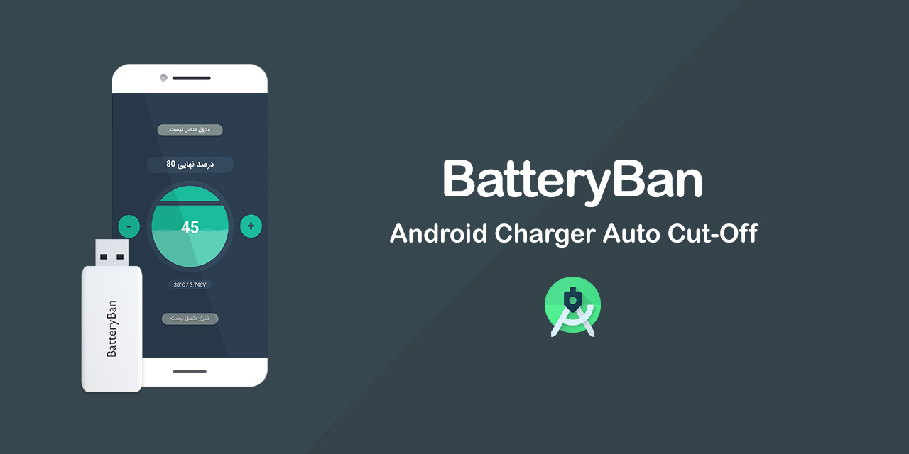
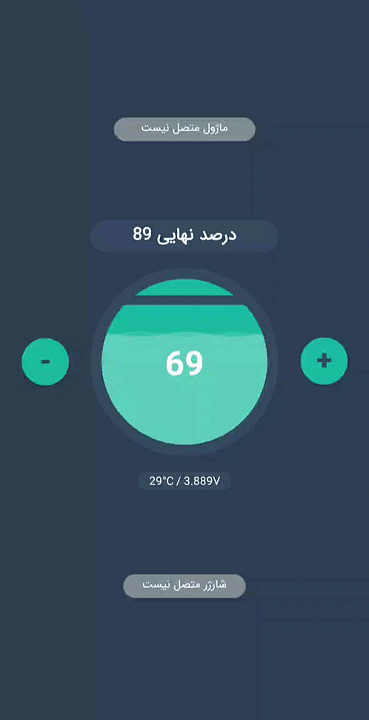

# BatteryBan

It's a single page app that controls the Battery Percentage of Android devices. It sends signals through UART to the microcontroller (MCU).
When the MCU receives `1`, It must connect the charger and when receives `0`, must cut-off the charger. So design your board and program the MCU to do Sth like this.😉
Source of the project is available, just open the `src` folder as a project in Android Studio and start modifying.

    

## Release
[Download APK v1.0.4](src/app/release/app-release.apk)

## Author
**Rabist** - view on [LinkedIn](https://www.linkedin.com/in/rabist)

## License
Licensed under [MIT](LICENSE).